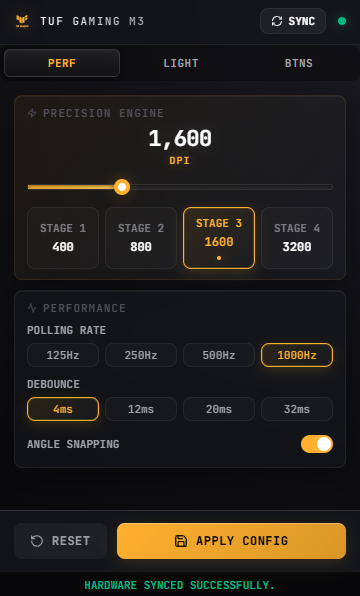
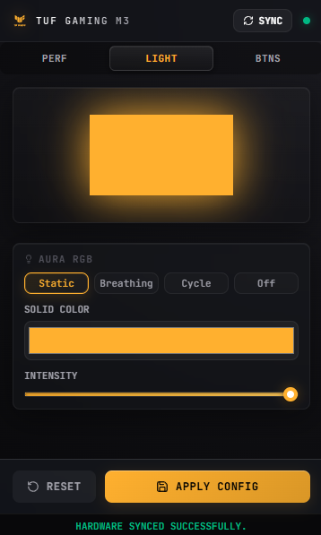
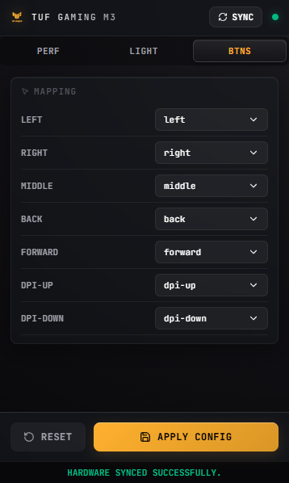

# ASUS TUF Gaming M3 — Controller

> A lightweight, open-source desktop utility for configuring the **ASUS TUF Gaming M3** mouse on Windows — without needing Armoury Crate.

Built with [Tauri 2](https://tauri.app/), [React 19](https://react.dev/), and [Rust](https://www.rust-lang.org/). Communicates directly with the mouse over **USB HID** (no driver installation required).

---

## Features

| Feature | Details |
|---|---|
| 🎯 **DPI Stages** | Configure all 4 DPI stages (100 – 5100 DPI) individually |
| ⚡ **Polling Rate** | Switch between 125 / 250 / 500 / 1000 Hz |
| 🖱️ **Debounce** | Adjust click debounce time (4 – 32 ms) |
| 📐 **Angle Snapping** | Toggle angle snapping on/off |
| 💡 **Aura RGB** | Control LED mode (Static, Breathing, Cycle, Off), color & intensity |
| 🔘 **Button Remapping** | Remap all 7 programmable buttons |
| 💾 **EEPROM Persistence** | Settings are saved directly to the mouse's onboard memory |
| 🔲 **System Tray** | Runs as a tray app — click the icon to toggle the compact UI |

---

## Screenshots

> The app sits in your system tray and pops up as a compact 360×600 panel.

| Performance | Light | Buttons |
|:-----------:|:-----:|:-------:|
|  |  |  |

---

## Requirements

### Runtime
- Windows 10/11 (x64)
- ASUS TUF Gaming M3 mouse connected via USB

### Build Dependencies

| Tool | Version | Install |
|---|---|---|
| [Rust](https://rustup.rs/) | stable | `rustup install stable` |
| [Bun](https://bun.sh/) | latest | `winget install Oven-sh.Bun` |
| [Tauri CLI](https://tauri.app/start/) | v2 | included in `devDependencies` |
| WebView2 | (usually pre-installed on Win 11) | [Download](https://developer.microsoft.com/en-us/microsoft-edge/webview2/) |

---

## Getting Started

### 1. Clone the repo

```bash
git clone https://github.com/your-username/asus-tuf-gaming-m3-tauri.git
cd asus-tuf-gaming-m3-tauri
```

### 2. Install frontend dependencies

```bash
bun install
```

### 3. Run in development mode

```bash
bun run tauri dev
```

> The Tauri window will open and hot-reload on frontend changes. The mouse must be connected for HID commands to work.

---

## Building

### Production build (Windows)

```bash
bun run tauri build --target x86_64-pc-windows-msvc
```

The installer and binary will be output to:

```
src-tauri/target/x86_64-pc-windows-msvc/release/bundle/
```

You'll find:
- `nsis/` — NSIS installer (`.exe`)
- `msi/` — MSI installer

### Frontend-only build (for debugging)

```bash
bun run build
```

Output goes to `dist/`.

---

## How It Works

The app talks to the mouse using raw **USB HID reports** via the [`hidapi`](https://crates.io/crates/hidapi) Rust crate.

- **Vendor ID**: `0x0B05` (ASUS)  
- **Product ID**: `0x1910` (TUF Gaming M3)  
- **Interface**: `1` (configuration interface)

Settings are read from and written to the mouse's **onboard EEPROM**, so they persist without any software running — changes survive reboots and work on any PC.

```
Frontend (React/TypeScript)
        │  invoke()
        ▼
Tauri IPC Bridge
        │
        ▼
Rust Backend (lib.rs)
        │  hidapi
        ▼
USB HID Interface 1
        │
        ▼
ASUS TUF Gaming M3 (onboard EEPROM)
```

---

## Project Structure

```
asus-tuf-gaming-m3-tauri/
├── src/                    # React frontend
│   ├── App.tsx             # Main UI (tabs: Perf, Light, Btns)
│   ├── App.css             # Styles
│   └── assets/             # Logo assets
├── src-tauri/              # Rust/Tauri backend
│   ├── src/
│   │   ├── lib.rs          # HID commands, Tauri command handlers
│   │   └── main.rs         # Entry point
│   ├── icons/              # App & tray icons
│   ├── capabilities/       # Tauri permission definitions
│   ├── Cargo.toml          # Rust dependencies
│   └── tauri.conf.json     # Tauri configuration
├── index.html
├── vite.config.ts
└── package.json
```

---

## Acknowledgements

This project was developed with AI assistance ([Google Antigravity](https://antigravity.google)) for code generation, USB HID protocol reverse engineering, and documentation.

---

## License

MIT © [Md Talha Zubayer](https://github.com/MdTalhaZubayer)
